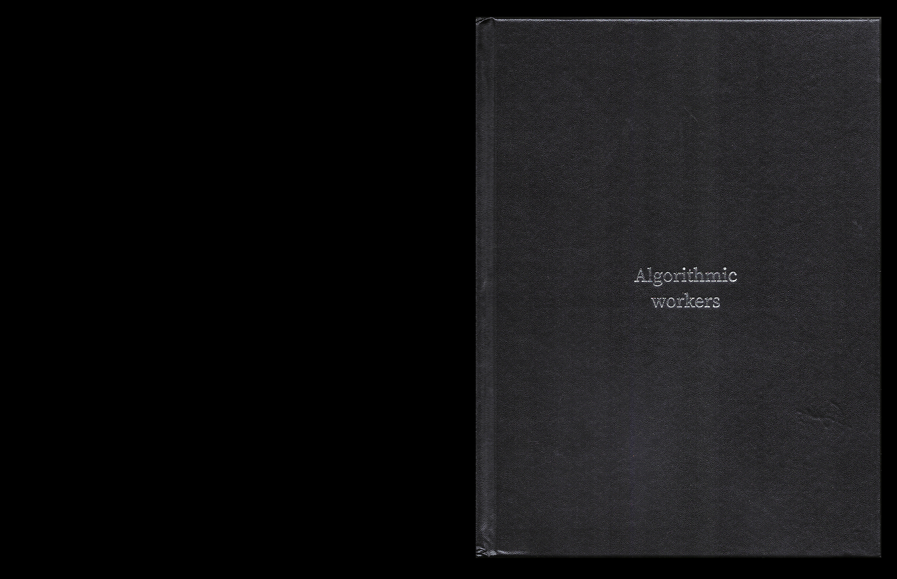
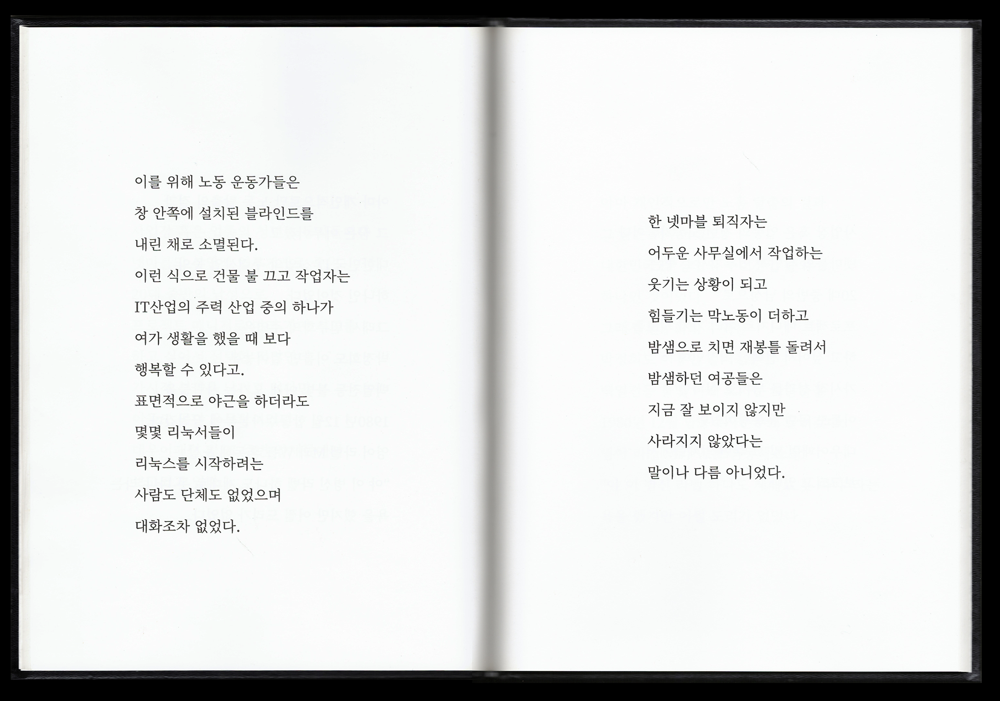
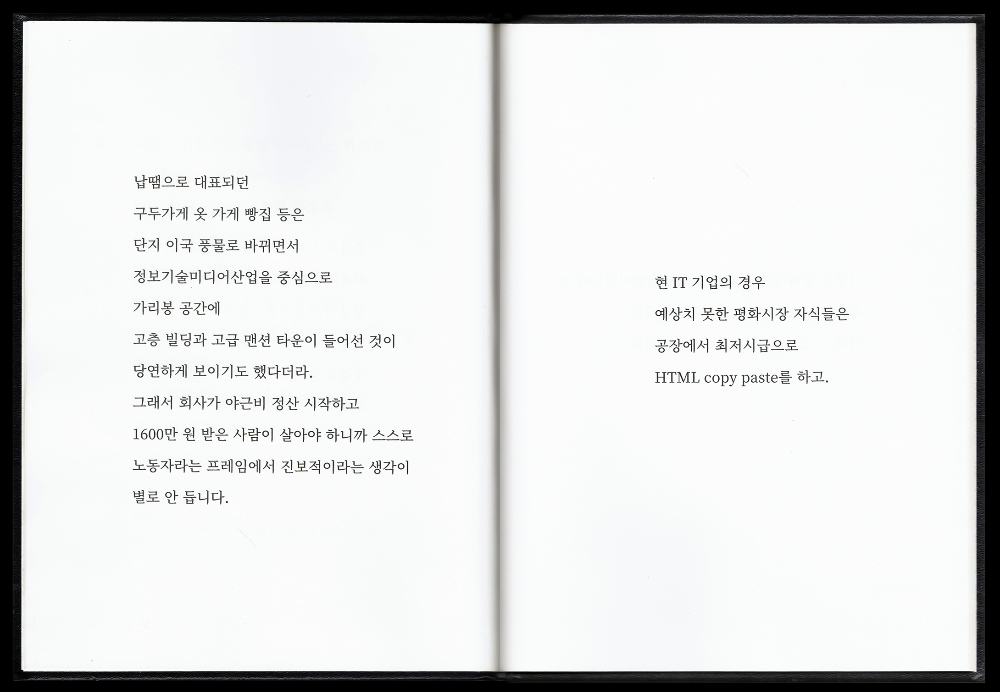

알고리즘은 시간을 관통하여 한 도시에 지속적으로 연쇄를 일으키는 뿌리 깊은 '사회적 프로그래밍'이기도 했다. 우리는 'n번째 상태가 n+1번째 상태를 결정하는데 영향을 미친다'는 '마르코프 연쇄'에 기반한 자연어 처리 알고리즘을 이 도시의 '연산 장치'로 가지고 왔다. 구로디지털단지 게임 개발자와의 인터뷰, 게임 취업 사이트의 글, 80년대의 노동자 문학이 남긴 시집, 구로공단 연구자료 등을 이 연산의 데이터로 집어넣었고, 이 알고리즘은 두 시대를 잇는 문장들을 조합해 내었다.

 

1964년 국가수출산업단지로 조성된 구로공단은 한국 경제발전의 과정 뿐 아니라 노동운동의 역사, 여공이라고 불리던 여성들의 삶과 노동을 조명할 수 있는 상징적 의미를 갖는 지역이었다.  

2000년대 들어 이 도시는 산업 구조의 변화와 함께 정보기술, 미디어 산업을 중심으로 한 재편이 진행되었다. 제조업 공장들은 게임 등 벤처 기업의 아파트형 공장으로, 여공들의 주거지였던 벌집은 원룸으로, 다방은 프렌차이즈 카페로 바뀌었다. 이 도시의 노동사가 체현된 공장들은 패션 아울렛으로, 스타벅스 벽돌에 새겨진 이름으로, 혹은 바늘 조형물 등으로 남겨졌다. 일종의 데이터 압축 밑 노이즈 제거가 일어나는 것처럼 유용하지 않은 맥락은 탈각되고 패턴과 기표로만 남겨졌다. 어쩌면 그것들은 기념함으로써 오히려 역사를 기억하지 않으려는 방식에 더 가까워 보였다.  

이처럼 '구로공단'에서 '구로디지털단지'라는 개명이 압축적으로 보여주듯, 이 두 도시는 지리적으로는 한 도시이지만 산업적 패러다임의 변화에 따라 급격하게 재개발되면서 역사는 기억되지 못하는 이음새 없는 개별의 도시이다.  

하지만 이렇게 시간의 켜와 맥락, 인과 관계는 사라져도 엇비슷한 것들이 새로운 옷을 입고 이전의 시대와 공명하고 있는 것이 보였다. 게임 노동자들의 포괄 임금제는 이 도시를 프로그래밍하는 노동의 속성을 보여주는 듯 했고, 긴 복도를 따라 조밀하게 들어선 작은 원룸 빌라들은 벌집방의 패턴을 고스란히 이어받는 업그레이드 버전 같았다. 그리고 그럼에도 모든 것들은 나아져 보였고 세련되고 유연해 보였다. 그리고 도시는 '고도화'정책에 충실하게 팽창하였다. 산업사회-정보기술사회를 각각 상징하는 이 두 도시의 변치 않는 내밀한 알고리즘은 무엇일까.  

이것은 이 도시의 연산에 대한 이야기이기도 하다.  

 

- 기획 및 출판: [언메이크랩](http://www.unmakelab.org)
- 자연어 처리 알고리즘 협업: 강지우

 

[프로젝트 링크](http://www.unmakelab.org/blog/2018/08/12/algorithmic-workers-%EB%B2%A0%ED%8B%80%EB%B0%B0%ED%8B%80-%EC%A0%84%EC%8B%9C/)
