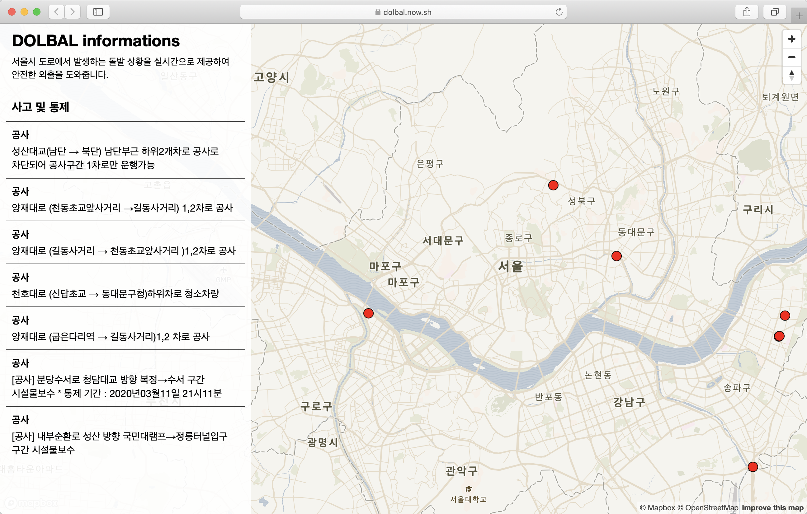

Dolbal은 서울시 도로에서 발생하는 돌발 상황을 실시간으로 제공하여 효율적인 외출 동선을 정하도록 도와주는 사이트입니다. 마커를 클릭하면 상세 돌발 정보를 확인할 수 있으며, 추후 유형별 돌발정보 및 주말에 예정된 집회 정보를 표시할 예정입니다.

[웹사이트](https://dolbal.now.sh/) [Github](https://github.com/constmoon/dolbal)

