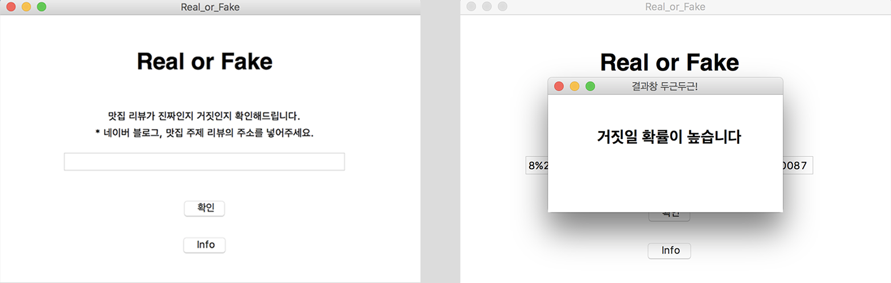

소비자들은 수많은 리뷰를 생산하고 공유하고 있다. 하지만 이 과정에서 일반 소비자들이 작성하는 리뷰와 공급자의 협찬을 받아 편향적으로 작성된 리뷰가 섞이면서 리뷰의 신뢰성이 떨어지고 있다. 소비자들은 ‘거짓 리뷰’를 가려내기 위해 여러 방법을 고안하였지만 확실하지 않은 필터링 방법이다. 본 프로젝트는 보다 효율적이고 정확하게 판단하기 위하여 진짜와 거짓 리뷰 간 통계적으로 유의미한 언어적 차이를 검증하고, 다양한 기계학습을 이용하여 리뷰의 진위를 판별하여 소비자에게 서비스로 제안한다. 

 

## 데이터 마이닝 및 전처리
후원을 받은 음식점 리뷰와 후원을 받지 않은 리뷰에 대한 데이터가 존재하지 않았기 때문에 자체적으로 데이터를 수집했다. 데이터를 수집할 때 ‘업체로부터 금전적 지원을 받았다’, ‘후원을 받았다’, ‘원고료를 지원 받았다’등의 언급이 있는 리뷰를 거짓 리뷰로 선정했다. 같은 방식으로 리뷰에 ‘사비로 음식을 사 먹었다’, ‘내 돈으로 직접’과 같은 언급이 있으면 진실된 리뷰로 선정하였다.
네이버 블로그 리뷰 약 11000개의 본문 텍스트와 사진 등의 정보를 크롤링하였으며, 리뷰의 진위를 확인하기 위한 기준으로 삼았던 문장은 모든 분석에서 외하였다. 데이터 수집 결과 거짓, 실제 리뷰의 개수는 거의 동일했다(거짓: 5782, 실제: 5368). 용이한 분석을 위해 모든 자연어 데이터를 Python의 Konlpy 패키지를 이용해 가공했고, 모든 단어를 어간 단위로 재구성했다.

## 품사 차이, 길이 차이 검증
수집한 리뷰 데이터가 언어적인 차이가 있는지 검증하기 위해 우리는 어간 단위로 재구성된 단어들의 품사를 구하고 두 집단간 품사의 비율에 차이가 있는지 살펴보았다. 또한 리뷰를 구성하고 있는 단어의 수를 조사해 포스팅 길이의 차이가 있는지 관찰했다. 분석 결과, 거짓 리뷰와 실제 리뷰 사이에는 사용된 단어의 수(LEN), 명사 비율(N), 동사 비율(V), 형용사 비율(ADJ), 부사 비율(ADV)에서 통계적으로 유의미한 차이가 있었다. 거짓 리뷰일수록 리뷰의 길이가 길고, 명사의 비율이 높으며, 동사의 비율이 적었다.

## 기계학습 방법 및 결과 구현
Python Scikit-learn 패키지를 이용해 SVM, KNN, Naive Bayes, Random Forest 분류 모델을 구축했다. 블로그 글들은 Doc2Vec 과 TF-IDF 방식 등을 이용하여 백터화(Vectorize) 하였다. 또한, 5겹 교차검증(5-fold cross validation)으로 데이터를 학습 및 테스트 하여 모델의 정확도(Accuracy)를 측정했다.
그 결과, SVM(linear) 모델이 0.84로 제일 좋은 성능을 보였으며, 각각의 모델을 만드는 데 사용된 정보와 모델의 예측 정확도에 차이가 있었다. Naive Bayes와 Random Forest의 경우 자연어 정보뿐만 아니라, 리뷰에서 사용된 사진의 개수, 이모티콘의 갯수 등의 정보 역시 사용하였으며, 음식점 상호명, 음식점이 위치한 곳을 추론하여 추가적인 정보로 활용하였다.  

프로젝트를 통해 업체로부터 후원받은 거짓리뷰와 실제리뷰 사이에 사용된 단어 수와 품사 비율에서 통계적으로 유의미한 차이가 있음을 밝힐 수 있었다. 이러한 접근은 음식점뿐만 아니라 다른 분야의 리뷰로도 확장할 수 있으며, 향후 소비자들에게 진실된 실제리뷰만을 보여주는 서비스를 제공하는 데에 활용될 수 있을 것이라 기대된다.

 

2017 성균관대학교 프로그래밍 동아리 Pyneer  
강지우, 김동욱, 송이현, 이범진, 이석범

[Poster](https://drive.google.com/file/d/1kROnEuHqCJR362Ul7MVYF8BpBXH7gCYT/view?usp=sharing) [Paper](http://www.dbpia.co.kr/Journal/ArticleDetail/NODE07322771) [Github](https://github.com/constmoon/Restaurant-review)