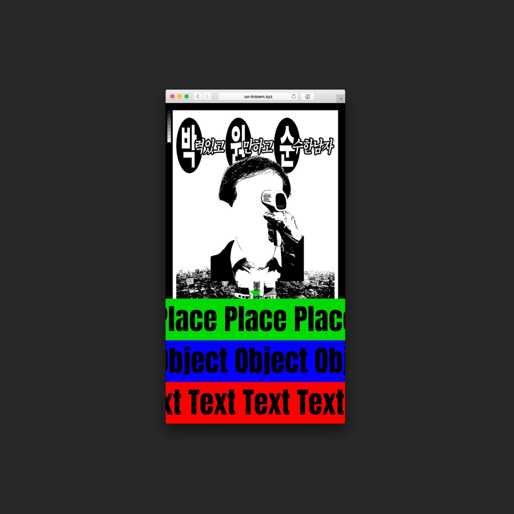
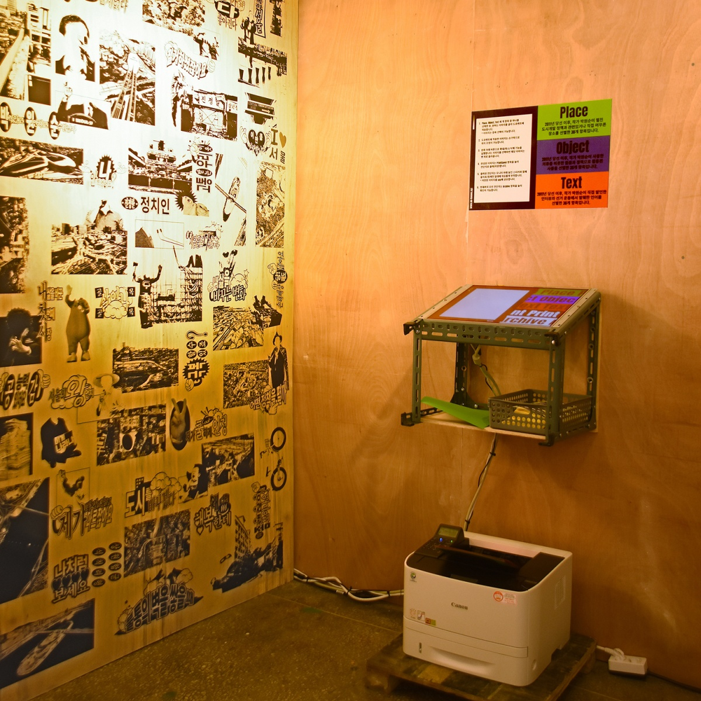
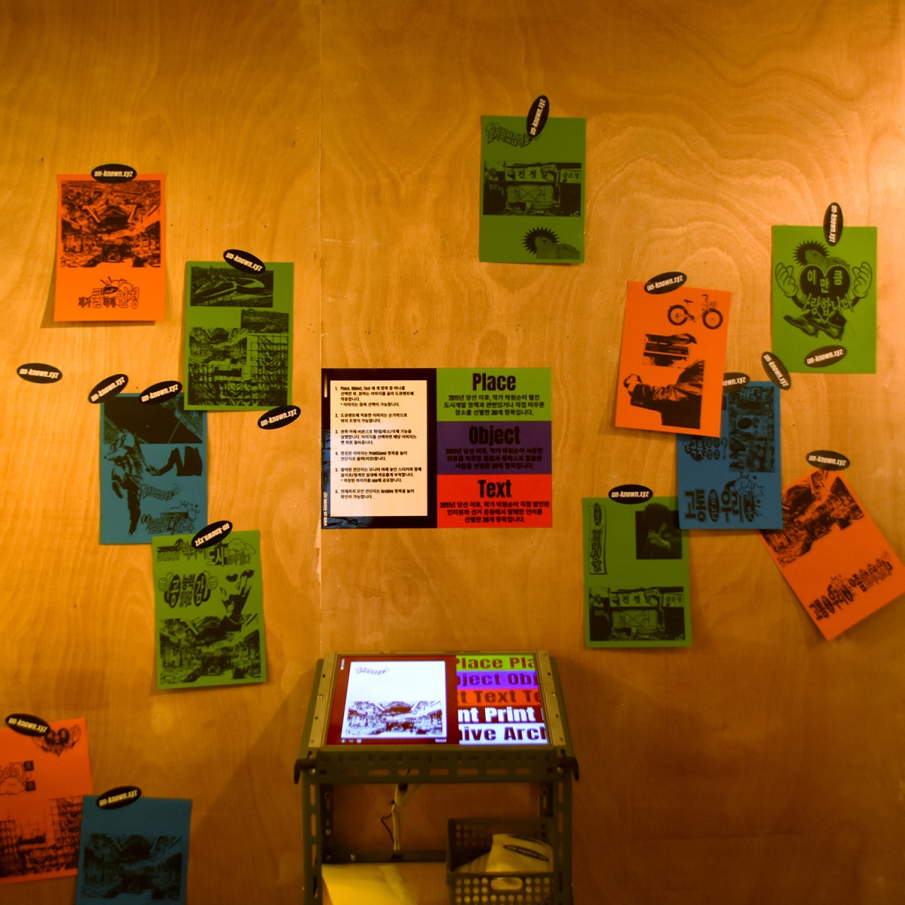

[일상의 실천](http://everyday-practice.com)과 함께 서울특별시장 당선 이후 미궁으로 향해가는 박원순 시장의 도시개발정책에 의문을 제기하는 ‘박원순 개인전’에 참여했습니다. [un-known.xyz(미지수)](http://un-known.xyz)는 일상의실천의 2019년 첫번째 자체 프로젝트로 박원순 시장 당선 이후 7년 간 그가 머무른 장소, 손을 거친 사물, 입이 내뱉은 언어를 단서로 선별, 관람객(사용자)의 선택과 조합으로 저마다의 전단을 만드는 작업입니다. 관람객(사용자)에 의해 매순간 결괏값이 다른 전단들은 2019년 현재, 박원순 시장을 이해하는 각자의 답이 될 수 있습니다.  

`vimeo: https://player.vimeo.com/video/325804631`

삶은 미지(未知)의 터전. 값을 내기 위해 온 생애를 산화하지만 결국 생애와 분리되는 순간에 이르러 제값을 부여받는 부조리의 터전이다. 태생과 함께 명명된 저마다의 이름은 언뜻 선명한 의미를 갖춘 듯 하나, 연속되는 선택의 순간이 누적되므로 각자의 의미는 점점 값을 알 수 없는 미지의 세계로 치닫게 된다.  

2011년부터 2019년까지 작가 박원순이 보여준 행보는 한 개인이 미지의 값을 찾아 나서는 여정과 닿아 있다. 그의 발이 지나간 장소와 몸이 걸쳤던 사물 그리고 입이 뱉었던 말은 언뜻 그의 여정을 설명하는 미지수에 가까워 보인다. 미지수의 궤적을 이어가다 보면 어느 순간 작가 박원순이 예상하는 결괏값의 실마리를 발견할 수 있지 않을까. 본 작업은 지난 8년 작가 박원순이 쌓아놓은 미지수의 기록으로부터 출발한다.  

[un-known.xyz(미지수)](http://un-known.xyz)는 제약된 연산 아래에서 미지수에 가까운 작가 박원순의 장소, 사물, 언어를 조합/산출하는 출력 프로그램이다. 프로그램이 작동하는 동안 사용자는 매번 다른 결괏값을 마주하게 되며, 마땅히 이는 변수에 상응한다. 기실 변수와 닮은 산출 값은 2019년 현재, 작가 박원순을 이해하는 저마다의 답이기도 하다.

 

- 디자인 및 기획: 김경철, 김어진, 권준호
- 디자인 및 자료조사: 김어진, 길혜진
- 웹 개발: 김경철, 강지우
- 웹 개발 도움: 조현익
- 영상: 김어진, 길혜진
- 영상 사운드: 김어진

 

[웹사이트](http://un-known.xyz) [프로젝트 링크](http://everyday-practice.com/portfolio/un-known-xyz/)